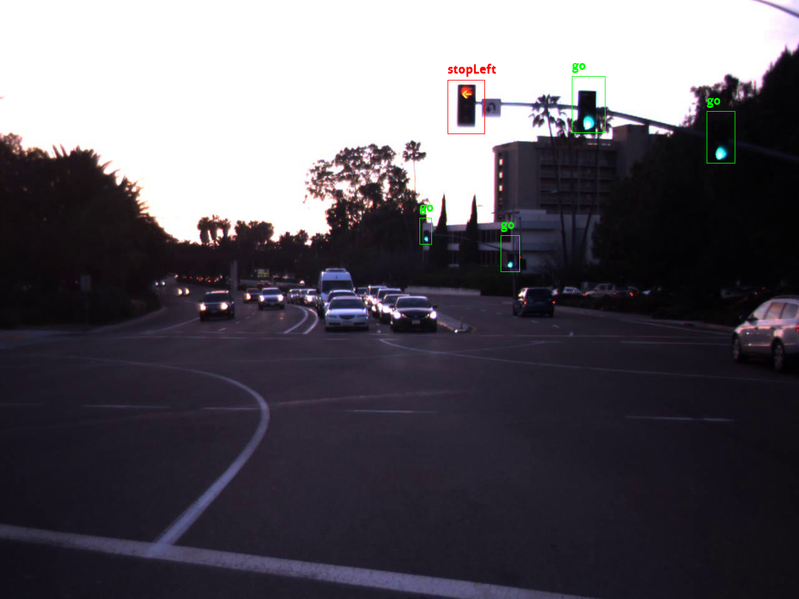

As part of my [Machine Learning Engineering course](https://www.springboard.com/workshops/ai-machine-learning-career-track/), I developed an end to end traffic light recognition system.

I decided to use [Pytorch](https://pytorch.org/) for this, due to it's relatively straightforward API and rapid prototyping abilities.

I used a pretrained Faster RCNN model to start with, and then fine tuned it on the [LISA Traffic Light dataset](https://www.kaggle.com/mbornoe/lisa-traffic-light-dataset).

The end result was an API that, if a user sends a POST request to it with an image containing a traffic lights, it would (hopefully) return the pixel coordinates of the traffic lights and the state of each traffic light (e.g. 'stop', 'go', 'goLeft').

I initially deployed this on AWS Elastic Beanstalk, but as I don't want to pay bucketloads for hosting it I've just uploaded the model to S3. If you want to try it out, [follow these instructions](https://github.com/aidandunlop/traffic_light_recognition).

This was a great experience for me - it allowed me to see a Machine Learning project through from data collection to model deployment. 

I hope to expand this project with different network architectures (such as YOLO or SSD), more varied data and perhaps integrating with Google Streetview API.

